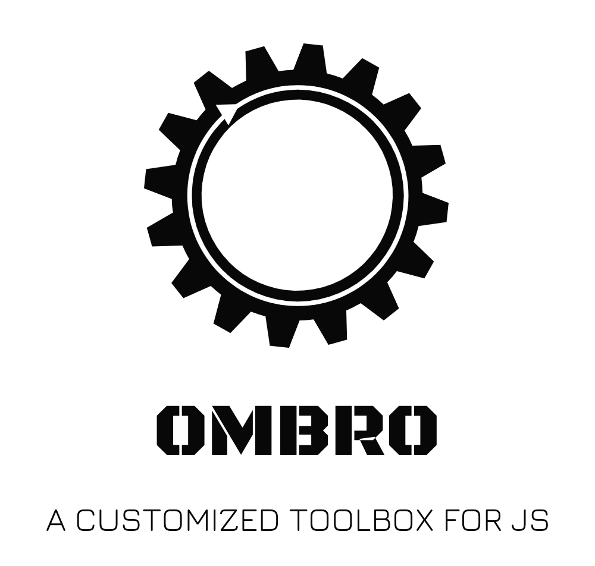

 

## Packages

- **Runtime or Builder**
  - [@ombro/node](./packages/node): A zero-configuration, quick-start ESNext Node.js runtime
  - [@ombro/ts-config](./packages/tsconfig): Out-of-the-box tsconfig.json preset for typescript
- **Node.js utils**
  - [@ombro/logger](./packages/logger): Provides preset and custom Node.js log output tools
- **Browser utils**

## License

[MIT](./LICENSE)
