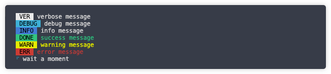

# @ombro/logger


[English](./README.md)

提供预设和自定义的 Node.js 日志输出工具



## 安装

```sh
$ npm install @ombro/logger
# or
$ yarn add @ombro/logger
```

## 使用

```js
import { logger } from '@ombro/logger'

logger.setLevelValue('verbose')

logger.verbose('verbose message')
logger.debug('debug message')
logger.info('info message')
logger.done('success message')
logger.warn('warning message')
logger.error('error message')

logger.loadding('wait a moment')

setTimeout(() => {
  logger.clearLoadding()
  logger.done('successful!')
}, 2000)
```

## API

### `logger.setLevel(level: string)`

设置允许打印的最低日志级别

- **level**
  - 最低级别
  - 类型: `'verbose' | 'info' | 'notice' | 'warn' | 'error' | 'silent'`
  - 默认值: `'info'`

### `logger.verbose(message: string, tag = '')`

打印一段详细日志

- **message**
  - 消息内容
  - 类型: `string`
  -
- **tag**
  - 消息前缀
  - 类型: `string`
  - 默认值: `''`

### `logger.debug(message: string, tag = '')`

打印一段调试日志

- **message**

  - 消息内容
  - 类型: `string`

- **tag**
  - 消息前缀
  - 类型: `string`
  - 默认值: `''`

### `logger.info(message: string, tag = '')`

打印一段信息日志

- **message**

  - 消息内容
  - 类型: `string`

- **tag**
  - 消息前缀
  - 类型: `string`
  - 默认值: `''`

### `logger.done(message: string, tag = '', plain = false)`

打印一段成功日志

- **message**

  - 消息内容
  - 类型: `string`

- **tag**

  - 消息前缀
  - 类型: `string`
  - 默认值: `''`

- **plain**
  - 是否为普通的样式，它将去掉原本的颜色
  - 类型: `boolean`
  - 默认值: `false`

### `logger.warn(message: string, tag = '', plain = false)`

打印一段警告日志

- **message**

  - 消息内容
  - 类型: `string`

- **tag**

  - 消息前缀
  - 类型: `string`
  - 默认值: `''`

- **plain**
  - 是否为普通的样式，它将去掉原本的颜色
  - 类型: `boolean`
  - 默认值: `false`

### `logger.error(message: string, tag = '', plain = false)`

打印一段错误日志

- **message**

  - 消息内容
  - 类型: `string`

- **tag**

  - 消息前缀
  - 类型: `string`
  - 默认值: `''`

- **plain**
  - 是否为普通的样式，它将去掉原本的颜色
  - 类型: `boolean`
  - 默认值: `false`

### `logger.startLoading(message: string): void`

显示旋转等待消息，只能同时存在一个

- **message**
  - 等待消息
  - 类型: `string`

### `logger.stopLoading()`

停止并清除等待消息

### `logger.clearConsole(title = '')`

清空当前控制台的输出信息，仅在 tty 终端下有效（macOS, Linux）

- **title**
  - 可选文本，清理后输出
  - 类型: `string`
  - 默认值: `''`

## CHANGELOG

[CHANGELOG.md](./CHANGELOG.md)

## LICENSE

MIT
